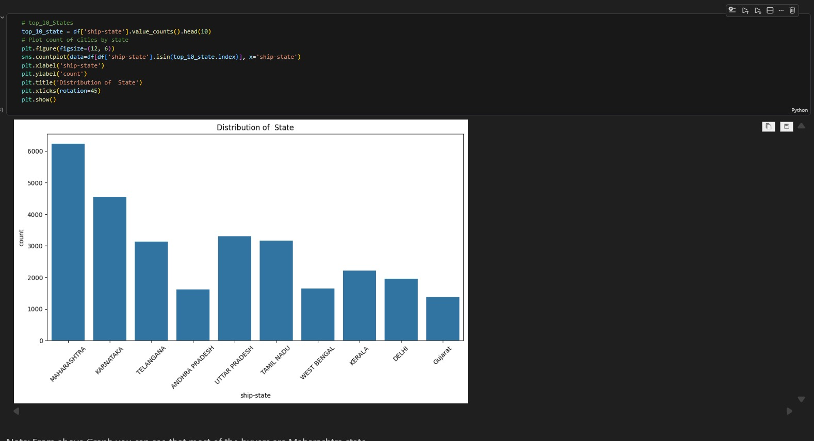
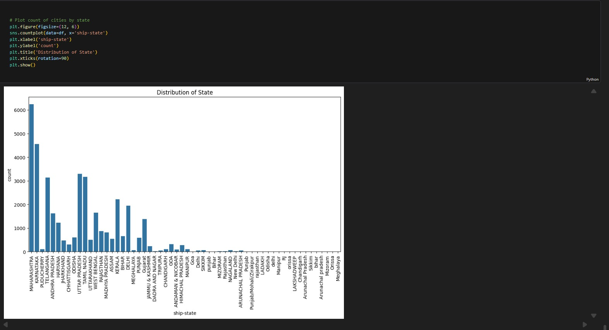
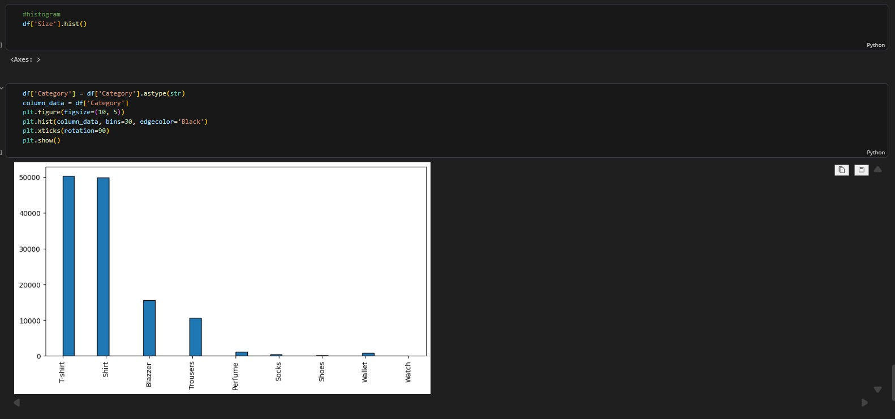
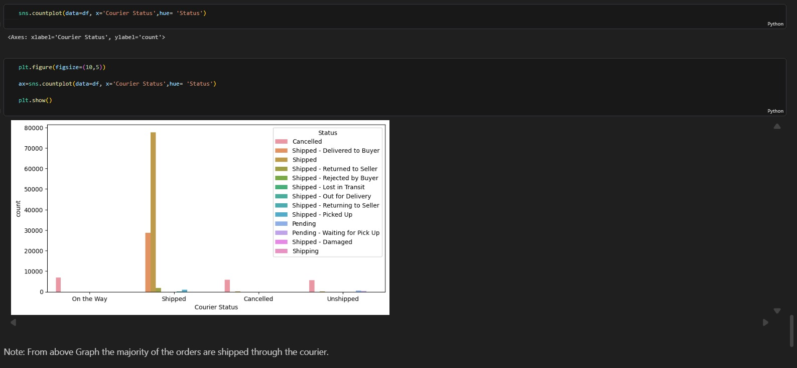
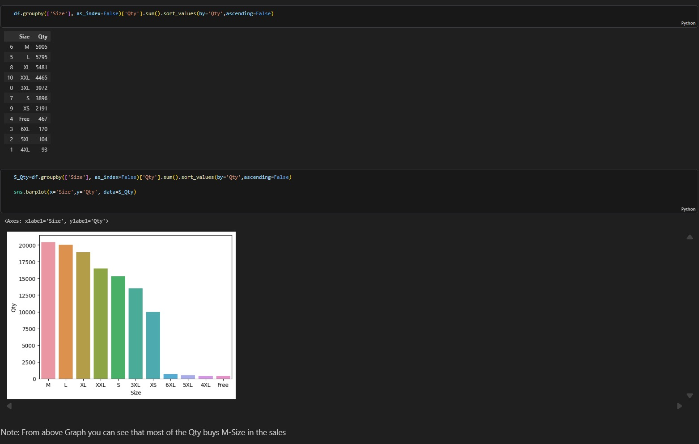
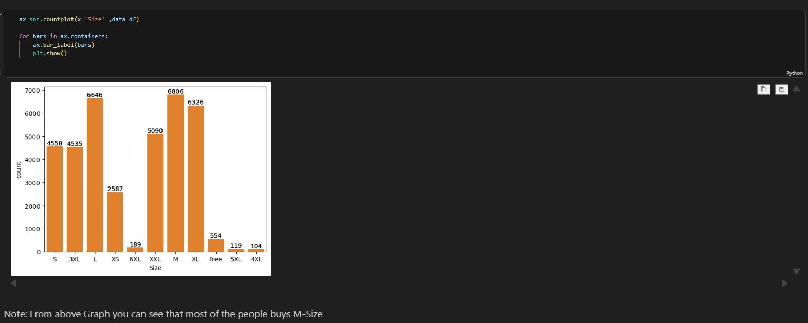
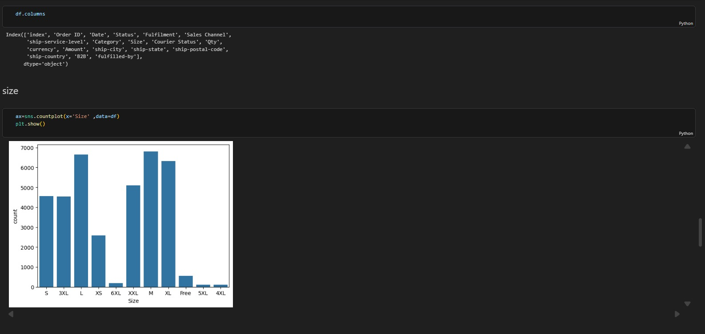
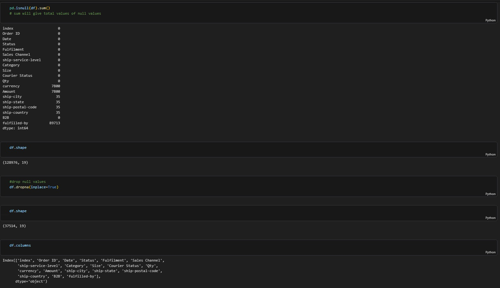

# 🛒 Amazon Sales Data Analysis

A comprehensive **Amazon Sales Data Analysis** project focused on transforming raw e-commerce sales data into meaningful business insights.

The project combines **data cleaning, exploratory data analysis, quantitative analysis, and data visualization** to understand sales performance, product behavior, customer purchasing patterns, geographic trends, and other important business metrics.

---

## 📊 Project Overview

E-commerce businesses generate large amounts of sales data that can be used to understand customer behavior, product performance, and revenue trends.

In this project, Amazon sales records are analyzed to identify important patterns and relationships within the data.

The analysis focuses on:

* Revenue and sales performance
* Product/category performance
* Sales trends
* Customer purchasing behavior
* Geographic distribution of orders
* Order status and fulfillment
* Seasonal purchasing patterns
* Quantity and order analysis
* Business performance indicators

The goal is to convert raw commercial data into **clear, actionable business intelligence**.

---

## 🎯 Project Objectives

The main objectives of this analysis are:

* Clean and prepare raw Amazon sales data for analysis.
* Explore the structure and quality of the dataset.
* Identify important sales and revenue drivers.
* Analyze product and category performance.
* Understand purchasing trends over time.
* Examine geographic sales distribution.
* Analyze order and fulfillment patterns.
* Create meaningful visualizations to communicate findings.
* Generate actionable business insights from the data.

---

## 🛠️ Tools & Technologies

| Tool / Technology    | Purpose                                |
| -------------------- | -------------------------------------- |
| **Python**           | Data analysis and processing           |
| **Pandas**           | Data cleaning and manipulation         |
| **NumPy**            | Numerical analysis                     |
| **Matplotlib**       | Data visualization                     |
| **Seaborn**          | Statistical visualization              |
| **Jupyter Notebook** | Analysis and documentation             |
| **CSV**              | Source dataset                         |
| **GitHub**           | Project repository and version control |

---

## 📁 Repository Structure

```text
amazon-sales/
│
├── Amazon Sale Report.csv
├── Amazon Sale Report.ipynb
│
├── amazon1.jpeg
├── amazon2.jpeg
├── amazon3.jpeg
├── amazon4.jpeg
├── amazon5.jpeg
├── amazon6.jpeg
├── amazon7.jpeg
├── amazon8.jpeg
│
└── README.md
```

The repository contains the raw dataset, complete Jupyter Notebook analysis, and eight visualization/dashboard images.

---

## 📦 Dataset

The primary dataset used in this project is:

```text
Amazon Sale Report.csv
```

The dataset contains Amazon sales/order information that can be explored across multiple dimensions such as:

* Orders
* Products
* Categories
* Sales amount
* Quantity
* Order status
* Fulfillment
* Shipping information
* Customer/location information
* Date-related attributes

The exact fields are explored and processed within the Jupyter Notebook.

---

# 🔄 Data Analysis Workflow

The project follows a structured data analytics workflow:

```text
Raw Amazon Sales Data
        ↓
Data Inspection
        ↓
Data Cleaning
        ↓
Data Transformation
        ↓
Exploratory Data Analysis
        ↓
Statistical Analysis
        ↓
Data Visualization
        ↓
Business Insights
```

---

# 🧹 Data Cleaning

Before performing analysis, the raw dataset is inspected and prepared for reliable analysis.

The cleaning process includes tasks such as:

* Identifying missing values
* Handling duplicate records
* Checking data types
* Standardizing columns
* Handling inconsistent values
* Preparing date-related fields
* Removing unnecessary information where appropriate
* Preparing the dataset for exploratory analysis

Proper data preparation ensures that the resulting analysis and visualizations are more reliable.

---

# 🔍 Exploratory Data Analysis

Exploratory Data Analysis (EDA) is performed to understand the underlying structure and behavior of the Amazon sales data.

The analysis explores areas including:

### 📈 Sales Performance

* Overall sales performance
* Revenue contribution
* Order volume
* Quantity sold
* Sales distribution

### 📦 Product Analysis

* Product/category performance
* Top-performing products
* Product demand
* Quantity sold by category
* Revenue contribution by product/category

### 👥 Customer Analysis

* Customer purchasing behavior
* Order patterns
* Geographic distribution
* Customer purchasing trends

### 🌍 Geographic Analysis

Sales and order activity can be examined across available geographic attributes such as:

* States
* Cities
* Regions
* Shipping locations

This helps identify areas with stronger or weaker sales activity.

### 📅 Time-Based Analysis

The project also explores sales behavior over time to identify:

* Purchasing trends
* Periodic fluctuations
* Seasonal patterns
* High and low sales periods

---

# 📊 Visualizations

The project includes multiple visualizations created during the analysis.

## Visualization 1



---

## Visualization 2



---

## Visualization 3



---

## Visualization 4



---

## Visualization 5



---

## Visualization 6



---

## Visualization 7



---

## Visualization 8



---

# 📌 Key Business Questions

The analysis is designed to answer questions such as:

1. What are the major revenue drivers?
2. Which products or categories perform best?
3. Which products contribute the most to sales?
4. What purchasing patterns can be observed?
5. Are there noticeable seasonal trends?
6. Which locations generate the highest order activity?
7. What are the major order-status patterns?
8. How does product demand vary across categories?
9. How does sales performance change over time?
10. Which areas represent potential opportunities for business growth?

---

# 💡 Business Insights

The analysis transforms raw sales records into business-oriented insights that can support decisions related to:

### Product Strategy

Identify high-performing products and categories to understand where demand is concentrated.

### Inventory Planning

Use historical purchasing patterns and product demand to support better inventory planning.

### Sales Strategy

Identify strong revenue-generating products, categories, and locations that can receive additional focus.

### Marketing

Understand purchasing trends and customer behavior to support targeted promotional strategies.

### Geographic Expansion

Analyze regional and location-level performance to identify areas with stronger sales potential.

### Seasonal Planning

Identify purchasing patterns across different periods to improve preparation for high-demand seasons.

---

# 🧠 Analytical Skills Demonstrated

This project demonstrates practical experience in:

* Data Cleaning
* Data Preprocessing
* Exploratory Data Analysis
* Quantitative Analysis
* Statistical Analysis
* Data Visualization
* Trend Analysis
* Product Analysis
* Sales Analysis
* Business Intelligence
* Insight Generation
* Python-based Data Analytics

---

# 💻 How to Run the Project

## 1. Clone the Repository

```bash
git clone https://github.com/tanviprajapati12/amazon-sales.git
```

## 2. Navigate to the Project

```bash
cd amazon-sales
```

## 3. Install Required Libraries

```bash
pip install pandas numpy matplotlib seaborn jupyter
```

## 4. Launch Jupyter Notebook

```bash
jupyter notebook
```

## 5. Open the Analysis

Open:

```text
Amazon Sale Report.ipynb
```

and run the notebook cells sequentially.

---

# 📚 Project Files

### `Amazon Sale Report.csv`

The raw Amazon sales dataset used for the analysis.

### `Amazon Sale Report.ipynb`

The main Jupyter Notebook containing:

* Data loading
* Data cleaning
* Data preprocessing
* Exploratory analysis
* Calculations
* Visualizations
* Business insights

### `amazon1.jpeg` – `amazon8.jpeg`

Visualization outputs and analysis screenshots included in the repository.

---

# 🚀 Future Improvements

Possible improvements to extend this project include:

* Build an interactive Power BI dashboard.
* Create an interactive Streamlit application.
* Add advanced customer segmentation.
* Perform product-level profitability analysis.
* Build sales forecasting models.
* Add automated KPI reporting.
* Perform deeper geographic analysis.
* Implement predictive analytics for future sales.
* Add an interactive executive-level dashboard.

---

# 📌 Project Summary

> Conducted a comprehensive analysis of Amazon sales records to identify key revenue drivers, seasonal purchasing trends, and product performance metrics. Performed data cleaning, exploratory and quantitative analysis, and developed clear visualizations to transform raw commercial data into actionable business intelligence.

---

# 👨‍💻 Author

**Tanvi Prajapati**

GitHub: [@tanviprajapati12](https://github.com/tanviprajapati12)

---

## ⭐ Support

If you found this project useful or informative, consider giving the repository a ⭐ on GitHub.

---

## 📄 License

This project is intended for **educational, learning, and portfolio purposes**.
